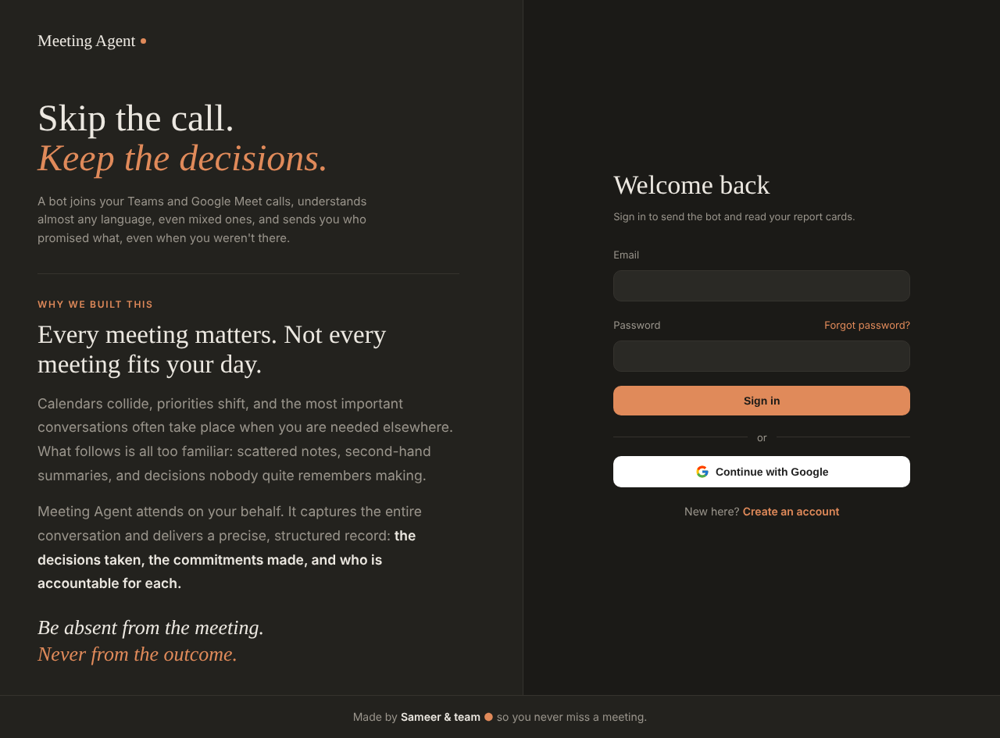
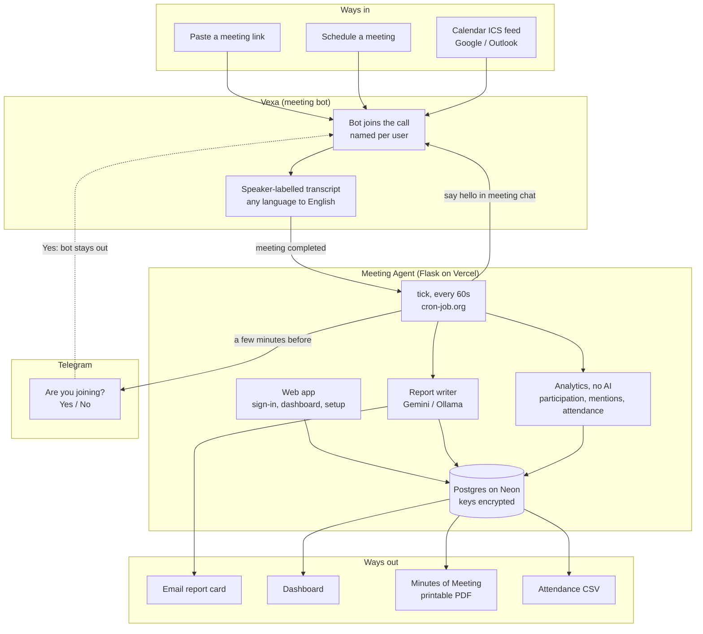

# Meeting Agent — AI notetaker for Microsoft Teams and Google Meet

A bot that joins your meeting as a visible participant, listens in Hindi,
Telugu, English or any mix of them, and sends an English report card when
the call ends: summary, decisions, action items with owners, who said what.
On top of that it produces formal Minutes of Meeting, per-person
participation, name mentions with timestamps, and a downloadable attendance
sheet. A Telegram check-in asks before each meeting whether you are joining
yourself, so the bot only goes in when you can't.

Live: **[meeting-agent-alpha.vercel.app](https://meeting-agent-alpha.vercel.app)**

[](https://meeting-agent-alpha.vercel.app)

## Numbers

| Metric                               | Value                                        |
|--------------------------------------|----------------------------------------------|
| Platforms                            | Microsoft Teams, Google Meet                 |
| Spoken languages                     | Hindi, Telugu, English, code-mixed           |
| Report language                      | English, always                              |
| **Report delivered after call ends** | **about 2 minutes** (live test, 2 Oct 2026)  |
| Background check interval            | 60 seconds                                   |
| Bot leaves an idle call after        | 10 minutes of silence                        |
| Outputs per meeting                  | Report card, MOM, participation, mentions, attendance CSV |
| Setup for a new user                 | 5 guided steps, 2 of them required           |
| Sign-in code                         | 6 digits, 15 minute expiry, 5 attempts       |
| Secrets at rest                      | Fernet-encrypted keys, hashed passwords and codes |
| **Running cost**                     | **₹0** on free tiers (Vercel, Neon, Gemini, Vexa credit) |

Delivery time was measured on the deployed app with a short Google Meet
call; longer meetings take longer to write up.

## Architecture



## Layered design decisions

Each layer adds one capability with a known cost.

| Layer            | What it adds                                    | Cost                              | Win                                      |
|------------------|-------------------------------------------------|-----------------------------------|------------------------------------------|
| Vexa bot         | Joins Teams and Meet, speaker-labelled transcript | Each user brings their own keys | No shared bill, meetings stay in the user's account |
| Translate mode   | Any spoken language to English text             | One flag on the bot request       | Mixed Hindi/Telugu/English meetings just work |
| Report writer    | Summary, decisions, action items, who said what | One LLM call per meeting          | Readable in a minute instead of replaying the call |
| No-guess prompt  | "None mentioned" instead of invented facts      | Shorter reports on thin meetings  | Reports can be trusted                   |
| Junk filter      | Drops transcription hallucinations before the LLM | A small phrase list             | No fake "thank you for watching" lines   |
| MOM              | Formal minutes: agenda, discussion, action table | A second LLM call                | Print-ready document for the record      |
| Analytics        | Participation %, mentions with time, attendance | Pure Python, no AI                | Exact numbers, nothing to hallucinate    |
| People directory | Email and designation on the attendance sheet   | One-time entry or CSV import      | Attendance usable by HR as is            |
| Telegram check-in| Asks before joining; Yes keeps the bot out      | One bot token for the app         | The bot only attends when you can't      |
| Notetaker name   | Bot joins as "Sameer's Notetaker"               | One setting per user              | People know whose bot they are admitting |
| Hello in chat    | Bot explains itself in the meeting chat         | One API call per meeting          | Nobody is surprised by a silent guest    |
| Calendar sync    | Auto-join every event with a meeting link       | Secret ICS link                   | Zero clicks per meeting                  |
| Email sign-in    | Password plus 6-digit email code                | SMTP or Brevo                     | Works without a Google account           |
| Google sign-in   | One-click sign-in, same account by email        | OAuth client                      | No password to remember                  |
| Encryption       | Fernet on every stored Vexa key                 | Depends on `SECRET_KEY`           | A database leak does not leak keys       |
| Cron tick        | One idempotent pass over all users              | External pinger every minute      | Runs on serverless with no worker        |

## Quick start

### Use the hosted app

1. Open [meeting-agent-alpha.vercel.app](https://meeting-agent-alpha.vercel.app) and sign in with email or Google.
2. Follow the **Set up** page: paste your two free [Vexa](https://vexa.ai) keys (required), confirm who gets the report (required), then optionally connect Telegram and your calendar.
3. Paste a meeting link under **Join now** and press **Send bot**.
4. Admit the notetaker from the lobby. It says hello in the chat.
5. End the call. The report card arrives by email and on the dashboard.

### Run it locally

Requirements: Python 3.11+, macOS or Linux.

```bash
git clone https://github.com/sameer-sde/meeting-agent.git
cd meeting-agent
python3 -m venv venv && source venv/bin/activate
pip install -r requirements.txt
cp .env.example .env        # fill in the values you need
python -m web.app           # http://localhost:5050
```

Locally you can sign in with **Continue on this computer**, the database is
a SQLite file, the background check runs in a thread, and reports are
written by Llama 3.1 through [Ollama](https://ollama.com) unless
`GEMINI_API_KEY` is set.

### Deploy your own

See [DEPLOY.md](DEPLOY.md): Neon database, Gemini key, Google sign-in,
Telegram bot, and the every-minute `/cron/tick` ping.

## What a meeting produces

| Output          | Where                              | Contents                                                        |
|-----------------|------------------------------------|-----------------------------------------------------------------|
| Report card     | Email and report page              | Summary, key decisions, action items, who said what, open questions |
| MOM             | **Minutes of Meeting** button      | Purpose, agenda, discussion by topic, decisions, action table; prints to PDF |
| Participation   | **Participation** tab              | Share of talk time, minutes, turns, High / Medium / Low per person |
| Mentions        | **Mentions** tab                   | How often each name was said, at what time, by whom, in which sentence |
| Attendance      | **Attendance** tab, CSV download   | Name, email, designation, attended or invited-but-not-heard      |
| Transcript      | Email attachment                   | Full speaker-labelled transcript as JSON                         |

Example report card email:

```
Hi Sameer,
Here's what happened in your meeting "Weekly sync" today (2 Oct, 7:26 AM · 4 min · 5 people).

Summary
Sameer checked in on the team's progress and assigned urgent tasks...

Action items
- Complete all assigned tasks | Owner: Zubair | Deadline: Today
```

## Routes

### Pages
| Method   | Path                          | Purpose                                         |
|----------|-------------------------------|-------------------------------------------------|
| GET      | `/`                           | Dashboard: bot status, coming up, report cards  |
| GET      | `/setup`                      | Guided 5-step onboarding                        |
| GET      | `/report/<id>`                | Report card with participation, mentions, attendance |
| GET      | `/report/<id>/mom`            | Printable Minutes of Meeting                    |
| GET      | `/report/<id>/attendance.csv` | Attendance download                             |
| GET/POST | `/people`                     | Team directory (name, email, designation)       |
| GET/POST | `/settings`                   | Keys, recipients, bot name, hello message       |
| GET      | `/help`                       | How everything works                            |

### Actions
| Method | Path                          | Body                     | Purpose                              |
|--------|-------------------------------|--------------------------|--------------------------------------|
| POST   | `/send`                       | `link`, `mode`           | Send the bot to a meeting now        |
| POST   | `/stop/<platform>/<id>`       | -                        | Pull the bot out                     |
| POST   | `/schedule`                   | `title`, `link`, `when`  | Join a future meeting                |
| POST   | `/calendar/connect`           | `name`, `ics_url`        | Auto-join from a calendar            |
| POST   | `/calendar/<id>/sync`         | -                        | Re-read the calendar now             |
| POST   | `/report/<id>/mom/generate`   | -                        | Rewrite the MOM                      |
| POST   | `/people/import`              | CSV file                 | Bulk-add the team directory          |
| POST   | `/settings/delete`            | -                        | Delete the account and all its data  |

### Sign-in
| Method   | Path                              | Purpose                                 |
|----------|-----------------------------------|-----------------------------------------|
| GET/POST | `/login`, `/signup`               | Email and password                      |
| GET/POST | `/verify`, `/forgot`, `/reset`    | 6-digit email codes                     |
| GET      | `/auth/google`, `/auth/callback`  | Google OAuth                            |

### Background
| Method | Path                    | Purpose                                                   |
|--------|-------------------------|-----------------------------------------------------------|
| GET    | `/cron/tick?key=...`    | One pass: Telegram, hello messages, reports, check-ins    |
| GET    | `/healthz`              | Liveness check                                            |

`/cron/tick` returns what it did:

```json
{"asked":0,"errors":0,"greeted":1,"reports":1,"telegram":2,"users":1}
```

## Telegram check-in workflow

What happens around one calendar meeting:

1. **A few minutes before the start**, the app sends a Telegram message:
   *Meeting "Weekly sync" starts at 12:00 PM. Are you joining it yourself?*

2. **You tap an answer**:
   - **Yes, I'll join**: auto-join is switched off for that meeting and the bot stays out.
   - **No, send the bot**: the bot joins and tells the meeting you couldn't make it.
   - **No answer**: the bot joins anyway, so nothing is missed.

3. **The bot knocks** as *Sameer's Notetaker*. Someone admits it, and it
   posts one hello message in the meeting chat.

4. **The call ends** (or stays silent for 10 minutes) and the bot leaves.

5. **Within a few minutes** the report card is emailed and appears on the
   dashboard, with the MOM, participation, mentions and attendance ready.

## Settings

| Variable                                      | What it's for                                         |
|-----------------------------------------------|-------------------------------------------------------|
| `SECRET_KEY`                                  | Signs cookies and encrypts users' Vexa keys           |
| `DATABASE_URL`                                | Postgres connection string (Neon)                     |
| `GEMINI_API_KEY`, `GEMINI_MODEL`              | Report and MOM writing                                |
| `GOOGLE_CLIENT_ID`, `GOOGLE_CLIENT_SECRET`    | Continue with Google                                  |
| `SMTP_*` or `BREVO_API_KEY`, `MAIL_FROM`      | Report emails and sign-in codes                       |
| `TELEGRAM_BOT_TOKEN`, `TELEGRAM_BOT_USERNAME` | The "are you joining?" check-in                       |
| `CRON_SECRET`                                 | Protects `/cron/tick`                                 |
| `PUBLIC_URL`, `DISPLAY_TZ`                    | Links in emails, and the time zone shown              |

Never commit a real `.env`. `.env.example` lists every setting with empty values.

## Project layout

```
web/
  app.py          routes: sign-in, dashboard, setup, reports, people, settings
  tasks.py        the tick: Telegram, hello messages, reports, check-ins
  vexa.py         meeting bot API client
  reports.py      transcript to report card and MOM
  analytics.py    participation, mentions, attendance (no AI)
  mailer.py       report emails and sign-in codes
  models.py       users, meetings, people (keys encrypted)
  templates/      pages
main.py           entry point for Vercel
DEPLOY.md         how to put it online
```

## Built with

| Part                          | Tool                                                              |
|-------------------------------|-------------------------------------------------------------------|
| Web app                       | Python, Flask, Jinja, SQLAlchemy                                  |
| Meeting bot and transcription | [Vexa](https://github.com/Vexa-ai/vexa) (open source, Apache 2.0) |
| Report writing                | Google Gemini online, Llama 3.1 via Ollama locally                |
| Database                      | Postgres on [Neon](https://neon.tech), SQLite locally             |
| Sign-in                       | Email codes, Google OAuth (Authlib)                               |
| Check-ins                     | Telegram Bot API                                                  |
| Hosting                       | [Vercel](https://vercel.com), pinged by cron-job.org              |

## Privacy

- The bot is a visible participant with its owner's name on it, and it says in the chat why it is there. Tell people the meeting is being transcribed.
- Each user's Vexa keys are encrypted at rest. Passwords and sign-in codes are stored only as hashes.
- Users can delete their account, report cards and directory from Settings.
- On Gemini's free tier, Google may use submitted content to improve its products. Use a paid tier for sensitive meetings.

## Roadmap

- [x] Bot joins Teams and Meet, any language to English
- [x] Report cards on the dashboard and by email
- [x] Calendar auto-join and Telegram check-in
- [x] Multi-user web app with email and Google sign-in
- [x] Minutes of Meeting, participation, mentions, attendance download
- [x] Per-user notetaker name and hello message in the meeting chat
- [ ] "Ask the meeting": chat with past meetings
- [ ] Send tasks to Planner, Jira or Trello
- [ ] Weekly digest of all meetings

---

Made by **[Sameer Ahmed](https://github.com/sameer-sde) & team**, so you never miss a meeting.
