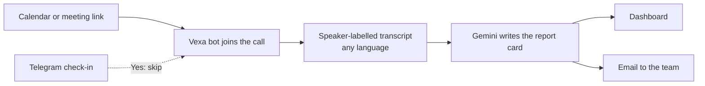

<div align="center">

# Meeting Agent

### Skip the call. Keep the decisions.

An AI notetaker that joins your **Microsoft Teams** and **Google Meet** calls, understands **Hindi, Telugu, English and mixed speech**, and sends you a report card: what was decided, who owes what, and who said it. Even when you weren't there.

**[Try it live → meeting-agent-alpha.vercel.app](https://meeting-agent-alpha.vercel.app)**

</div>

---

## What it does

| | |
|---|---|
| **Joins for you** | Paste a meeting link, schedule one, or connect your calendar. The bot joins as *Meeting Agent*. |
| **Understands every language** | Hindi, Telugu, English and Hinglish are transcribed, and the report is always in clear English. |
| **Report card after every call** | Summary, key decisions, action items with owners and deadlines, who said what, and open questions. |
| **Asks before it goes** | A Telegram message before each meeting: *are you joining?* Tap **Yes** and the bot stays out; **No** or no answer and it goes in your place. |
| **Delivered where you look** | On your dashboard and by email, with the full transcript attached. |
| **Yours only** | Sign in with Google. Each person uses their own Vexa account, and nobody sees anyone else's meetings. Keys are stored encrypted. |

## How it works



1. **Vexa** sends a bot into the Teams or Meet call and records who said what.
2. When the meeting ends, the app collects the transcript.
3. **Gemini** turns it into a report card in English, without inventing facts.
4. The report appears on the dashboard and is emailed to everyone on your list.

## Use it

1. Open **[meeting-agent-alpha.vercel.app](https://meeting-agent-alpha.vercel.app)** and continue with Google.
2. The **Set up** page walks you through it:
   - create a free [Vexa](https://vexa.ai) account and paste your two keys
   - choose who gets the report card
   - connect Telegram (optional, recommended)
   - connect your Google or Outlook calendar (optional)
3. Send the bot to your next meeting, admit it from the lobby, and get your report card a few minutes after the call ends.

## Built with

| Part | Tool |
|---|---|
| Web app | Python, Flask, Jinja |
| Meeting bot and transcription | [Vexa](https://github.com/Vexa-ai/vexa) (open source, Apache 2.0) |
| Report writing | Google Gemini (online) or Llama 3.1 via Ollama (local) |
| Database | Postgres on [Neon](https://neon.tech), SQLite locally |
| Sign-in | Google OAuth (Authlib) |
| Check-ins | Telegram Bot API |
| Hosting | [Vercel](https://vercel.com) |

## Run it yourself

**On your computer**

```bash
git clone https://github.com/sameer-sde/meeting-agent.git
cd meeting-agent
python3 -m venv venv && source venv/bin/activate
pip install -r requirements.txt
cp .env.example .env        # fill in the values you need
python -m web.app           # http://localhost:5050
```

Locally you can sign in with **Continue on this computer**, and reports are written by Llama 3.1 through [Ollama](https://ollama.com) unless you set `GEMINI_API_KEY`.

**Online**

See **[DEPLOY.md](DEPLOY.md)** for the full Vercel setup: Neon database, Gemini key, Google sign-in, Telegram bot, and the every-minute background check.

## Settings

| Variable | What it's for |
|---|---|
| `SECRET_KEY` | Protects sign-in cookies and encrypts users' Vexa keys |
| `DATABASE_URL` | Postgres connection string (Neon) |
| `GEMINI_API_KEY`, `GEMINI_MODEL` | Report writing |
| `GOOGLE_CLIENT_ID`, `GOOGLE_CLIENT_SECRET` | Sign in with Google |
| `TELEGRAM_BOT_TOKEN`, `TELEGRAM_BOT_USERNAME` | The "are you joining?" check-in |
| `SMTP_*` or `BREVO_API_KEY`, `MAIL_FROM` | Emailing report cards |
| `CRON_SECRET` | Protects the `/cron/tick` background check |
| `PUBLIC_URL`, `DISPLAY_TZ` | Links in emails, and the time zone shown |

Never commit your real `.env`. `.env.example` lists every setting with empty values.

## Project layout

```
web/
  app.py          routes: sign-in, dashboard, setup, settings, reports
  tasks.py        background check: reports, Telegram questions
  vexa.py         meeting bot API client
  reports.py      transcript → report card
  mailer.py       email delivery
  models.py       users, meetings (keys encrypted)
  templates/      pages
main.py           entry point for Vercel
DEPLOY.md         how to put it online
```

## Privacy

- Tell people in the meeting that it's being recorded. The bot appears as a visible participant.
- Each user's Vexa keys are encrypted at rest. Users can delete their account and all report cards from Settings.
- On Gemini's free tier, Google may use submitted content to improve its products. Use a paid tier for sensitive meetings.

## Roadmap

- [x] Bot joins Teams and Meet, any language to English
- [x] Report cards on the dashboard and by email
- [x] Calendar auto-join and Telegram check-in
- [x] Multi-user web app with Google sign-in
- [ ] "Ask the meeting": chat with past meetings
- [ ] Download report card as PDF
- [ ] Send tasks to Planner, Jira or Trello
- [ ] Weekly digest of all meetings

---

<div align="center">

Built by **[Sameer Ahmed](https://github.com/sameer-sde)**

</div>
